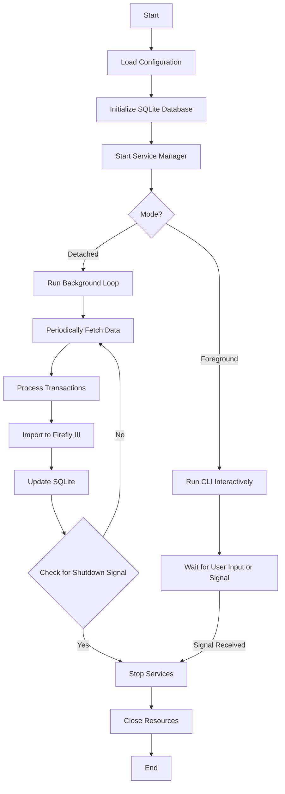
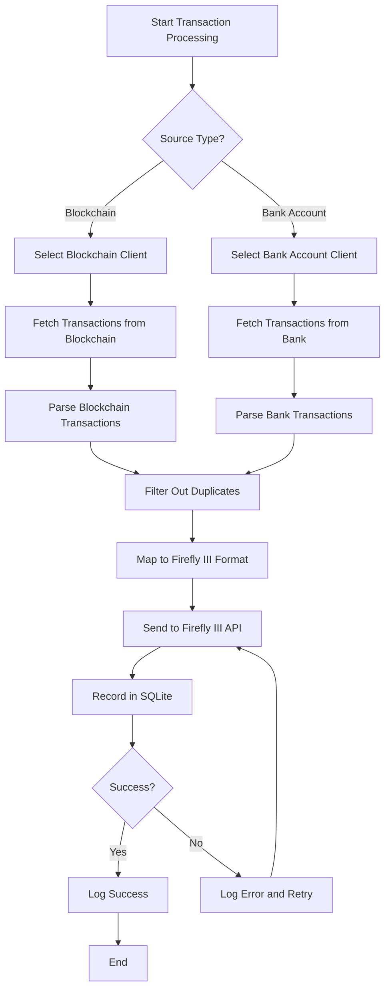
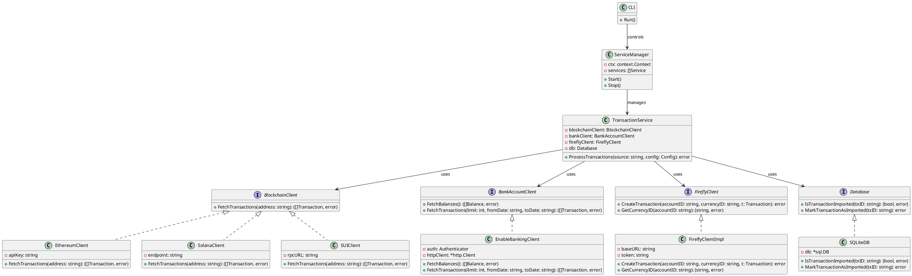
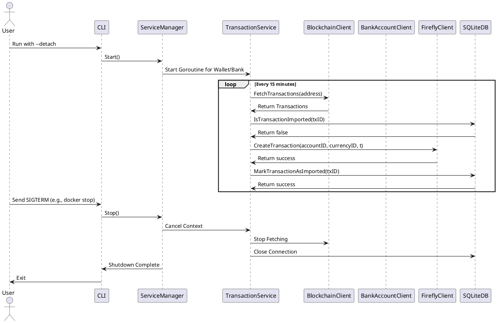

# 1. Flow Chart for Main Workflow

This flow chart outlines the high-level process of the application, from startup to shutdown, accommodating both foreground and detached modes.

### Explanation

- **Startup**: The application begins by loading its configuration (e.g., API keys, database paths) and initializing an SQLite database for storing transaction records.
- **Service Manager**: A central component starts, managing the application's services.
- **Mode Selection**:
  - In **foreground mode**, the CLI runs interactively, waiting for user commands or a shutdown signal (e.g., Ctrl+C).
  - In **detached mode**, it enters a background loop, periodically fetching data (e.g., every 15 minutes).
- **Detached Mode Loop**: Data is fetched, transactions are processed, imported into Firefly III (a financial management tool), and recorded in SQLite. The loop continues unless a shutdown signal is received.
- **Shutdown**: Upon receiving a signal (e.g., SIGTERM), services stop, resources (e.g., database connections) are closed, and the application exits gracefully.

---

## 2. Flow Chart for Transaction Processing

This flow chart details the process of fetching and importing transactions from a single source (blockchain wallet or bank account).

### Explanation

- **Source Selection**: The process identifies whether transactions come from a blockchain (e.g., Ethereum) or a bank account.
- **Client Selection**: The appropriate client (e.g., `EthereumClient` or `EnableBankingClient`) is chosen to fetch raw transaction data.
- **Fetching and Parsing**: Transactions are retrieved and parsed into a standard internal format.
- **Duplicate Filtering**: SQLite is queried to exclude already-imported transactions, preventing duplicates.
- **Mapping**: Transactions are transformed into Firefly III's expected API format (e.g., specifying account IDs, amounts, and currencies).
- **Import**: Transactions are sent to Firefly III via its API, then recorded in SQLite.
- **Error Handling**: Success is logged; failures trigger retries (e.g., for transient network issues) before logging an error.

---

## 3. Class Diagram (UML)

This UML class diagram represents the system's static structure, highlighting key interfaces, classes, and their relationships.

### Explanation

- **Interfaces**:
  - `BlockchainClient`: Defines methods for fetching blockchain transactions.
  - `BankAccountClient`: Handles bank-related data retrieval.
  - `FireflyClient`: Manages interactions with Firefly III's API.
  - `Database`: Abstracts database operations.
- **Implementations**:
  - Blockchain clients (`EthereumClient`, `SolanaClient`, `SUIClient`) use specific APIs or endpoints.
  - `EnableBankingClient` connects to bank APIs.
  - `FireflyClientImpl` and `SQLiteDB` provide concrete implementations for Firefly III and SQLite interactions.
- **Core Logic**:
  - `TransactionService` coordinates transaction processing, depending on injected clients and a database.
  - `ServiceManager` manages service lifecycles using a context for cancellation.
  - `CLI` provides the user interface, controlling the `ServiceManager`.

---

## 4. Sequence Diagram (UML)

This UML sequence diagram models the interaction between components during transaction import in detached mode.

### Explanation

- **Startup**: The user launches the CLI with a `--detach` flag, prompting the `ServiceManager` to start.
- **Background Processing**: The `ServiceManager` spawns a goroutine in `TransactionService` for each source (wallet or bank account).
- **Periodic Fetching**: Every 15 minutes, `TransactionService`:
  - Fetches transactions via `BlockchainClient` (or `BankAccountClient`, omitted here for brevity).
  - Checks SQLite (`IsTransactionImported`) to avoid duplicates.
  - Sends new transactions to `FireflyClient` for import.
  - Marks them as imported in SQLite.
- **Shutdown**: A SIGTERM signal (e.g., from Docker) triggers the `ServiceManager` to cancel contexts, stopping fetches and closing database connections before exiting.

---

## Conclusion

These diagrams provide a comprehensive, technically accurate supplement to the EDD:

- **Main Workflow**: Clarifies the application's lifecycle and mode-specific behaviors.
- **Transaction Processing**: Details the steps for handling transactions, including error management.
- **Class Diagram**: Defines a modular, extensible structure with clear dependencies.
- **Sequence Diagram**: Validates the dynamic behavior and concurrency in detached mode.

They ensure alignment between design and implementation, facilitating development, debugging, and future enhancements. Let me know if you need further refinements or additional diagrams!
